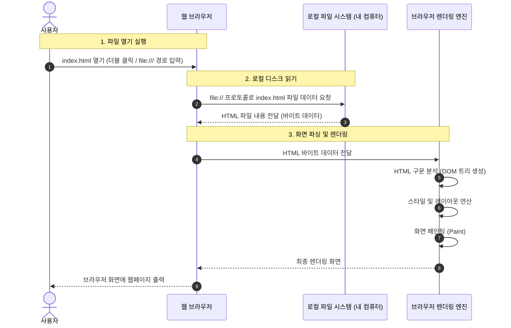
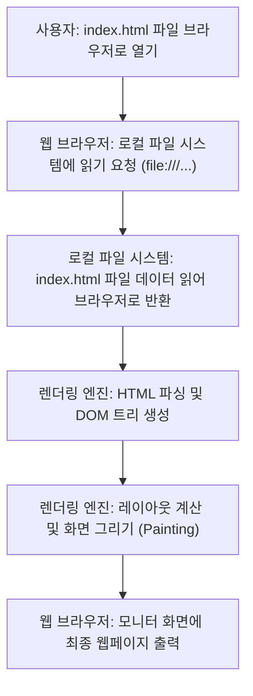

# 로컬 HTML 파일 실행 프로세스 다이어그램

## 1. 시퀀스 다이어그램 (Sequence Diagram)

## 2. 플로우차트 (Flowchart)

## 3. 핵심 단계 설명
- **파일 열기**: 사용자가 로컬에 있는 `index.html`을 브라우저로 실행합니다.
- **로컬 파일 I/O**: 브라우저가 네트워크 서버가 아닌 내 컴퓨터의 파일 시스템(`file:///`)에 직접 접근하여 HTML 텍스트를 읽어옵니다.
- **파싱 및 화면 렌더링**: 읽어온 HTML 코드를 브라우저 렌더링 엔진이 해석(DOM 트리 구성)하고 레이아웃을 계산하여 화면에 표시합니다.
